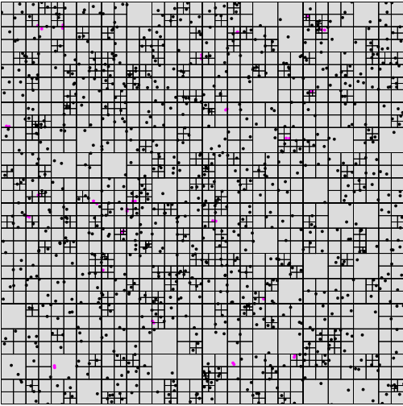
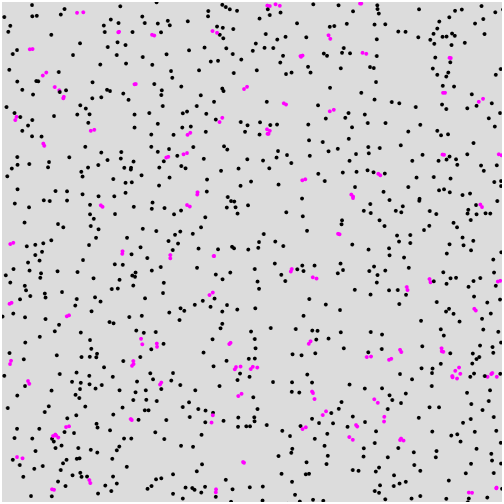
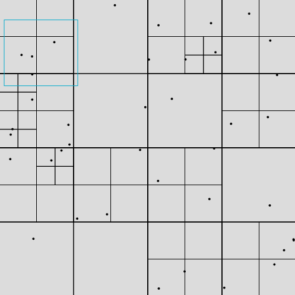

<div align=center >
  
  

  <h1>
  Brug af <strong>QuadTree</strong> til udrening af kollision mellem partikler
  </h1>

  <p>
  Udarbejdet af <strong><em>Markus Ingerslev Olsen</em></strong>
  </p>
</div>

I dette projekt har jeg benyttet et quadtree til at beregne kollisionerne mellem forskellige partikler indenfor et område.

Mening med dette projekt er at vise foredelene ved at benytte et quadtree. I dette tilfælde bliver quadtree brugt til at formindske antalet af operationer programmet skal udføre for at lave sine beregninger. En online version af løsningen kan findes på [QuadTree](https://markusingerslev.github.io/Datastrukturer-og-algoritmer-eksamen/). Hvis du ønsker at skifte mellem at benytte enten quadtree eller brute force, så klik på knappen `Q` på siden.

#### Med og uden quadtree

Programmet er lavet sådan at det skal tjekke om et punkt (`point / particle`) rammer et andet punkt `collision`. Måden den gør dette på er at programmet ud fra vært punkt, tjeker mod alle andre punkter i programmet. Dette resultere i at programmet har en BigO notation på `n^2`, sådan at hvis den skal beregne om et punkt kollidere og der er 1000 punkter, så er det 1.000.000 operation. I programmet kan man se at denne mængde operationer påvirker fps (`frames per second`), sådan at programmet køre langsommere.

Hvis programmet derimod benytter et `quadtree` til at opdele hvor punkter indenfor områder er lokaliseret, så mindskes mængden af operationer programmet skal udføre. Grunden til dette er at et **punkt** nu ikke længere skal sammenlignes med alle **punkter** i programmet, men i stedet kun behøver at tjekker de **punkter** som befinder sig indenfor selv samme område hvor **punktet** selv er placeret. 

På billedet nedenfor kan et eksempel på dette ses.På billedet er en blå firkant, hvor at indenfor den ene af de mindre `quadtree` opdelinger er to **punkter**. Disse **punkter** behøver ikke tjekke hele `canvas` området for at se om lige de to **kollidere**, men kan i stedet nøjes med at tjekke lige deres opdelings område, som i dette tilfælde ville være `quadtree` området `northWest -> SouthWest`.


<div align="center">
   
</div>

### Kør programmet lokalt

Hvis du skal køre programmet lokalt, så er det eneste du behøver at køre det html filen i en browser.

For at ændre på mængden af `partikler` i programmet så er det meget simpelt. Først skal du navigere ind i filen `./js/sketch.js`. Alt du så behøver at at ændre på enkelte tal

```JavaScript
...
let capacity = 1; // Mængde partikler der kan være i et område inden opdeling
let num = 1050; // antal partikler i alt
let radius = 2; // størrelse af partikler 
...

...
let size = 500; // Størrelse af canvas kvadrat
...
```